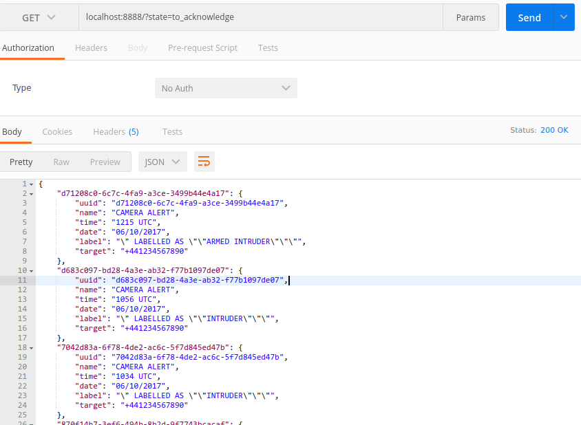
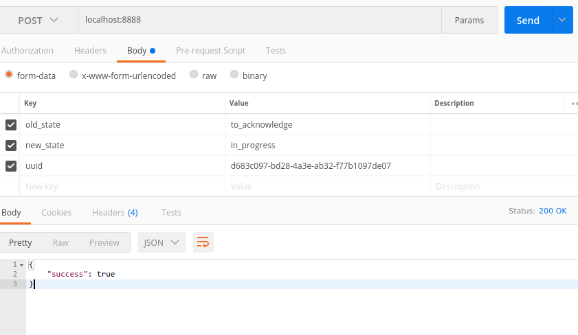
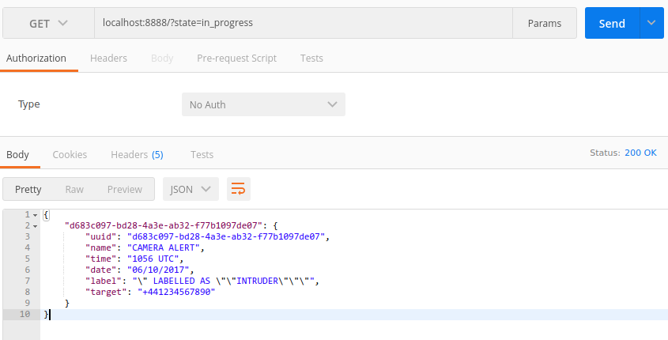

# Alert server


## Overview

* Reads the alerts from a `.csv` and monitors it in the background for updates

* Accepts `GET`/`POST` requests to query alerts and update their state

* Simulates dispatch logic to different targets *(groups of rangers)*

* Provides in-memory database for alert data


## API

* `GET` @ `url:port/?state=MY_STATE`

  Returns a JSON list of alerts whose state is `MY_STATE`.

* `POST` @ `url:port/`

  Arguments:

    * `uuid`: UUID of the alert to mutate.

    * `old_state`: expected current state of the alert.

    * `new_state`: new state of the alert.

  Returns a JSON object with the result *(`bool`)* of the state change.


## Example workflow

1. Start the server with:

   ```bash
   # remove monitoring metadata, if existing
   rm -f alerts.csv.offset

   # start server, monitor `alerts.csv`, send sms to "+441234567890"
   ./alert_server.py alerts.csv +441234567890
   ```

2. Via a `GET` request, check what alerts have been dispatched, but not yet acknowledged:

   

   *(This is meant to be executed from some UI service that is displaying the state of the system.)*

3. Via a `POST` request, mutate the state of an alert:

   

   *(This is meant to be executed from some downstream service that produces an alert in SMS/radio form.)*

4. Via a `GET` request, verify that the mutation took place:

   

   *(This is meant to be executed from some UI service that is displaying the state of the system and/or from downstream services that produce alerts for verification purposes.)*
