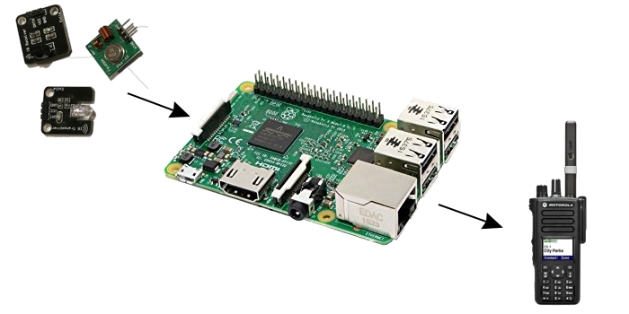
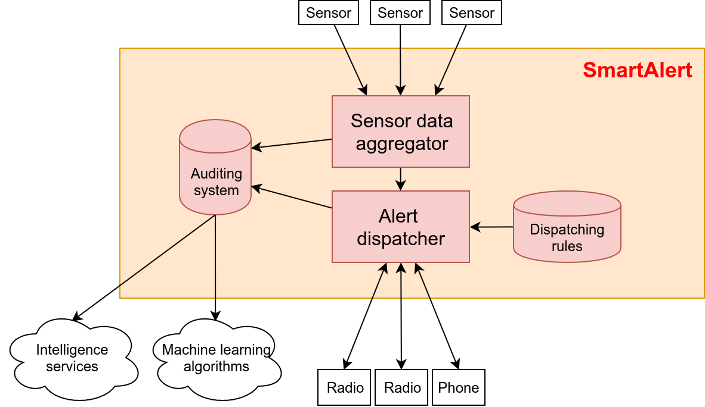
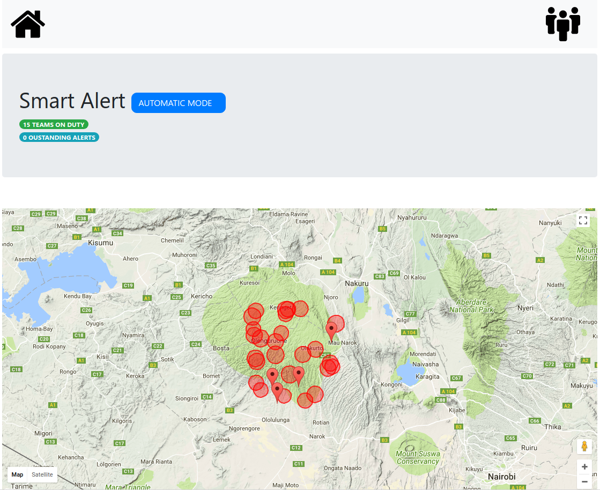
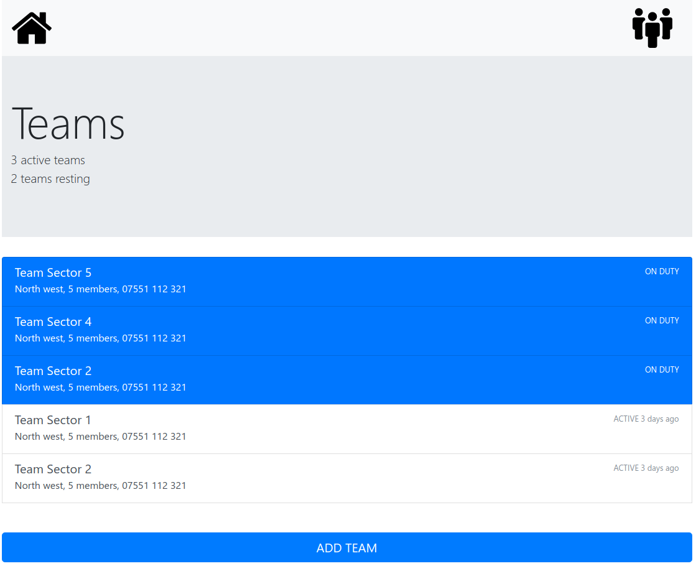
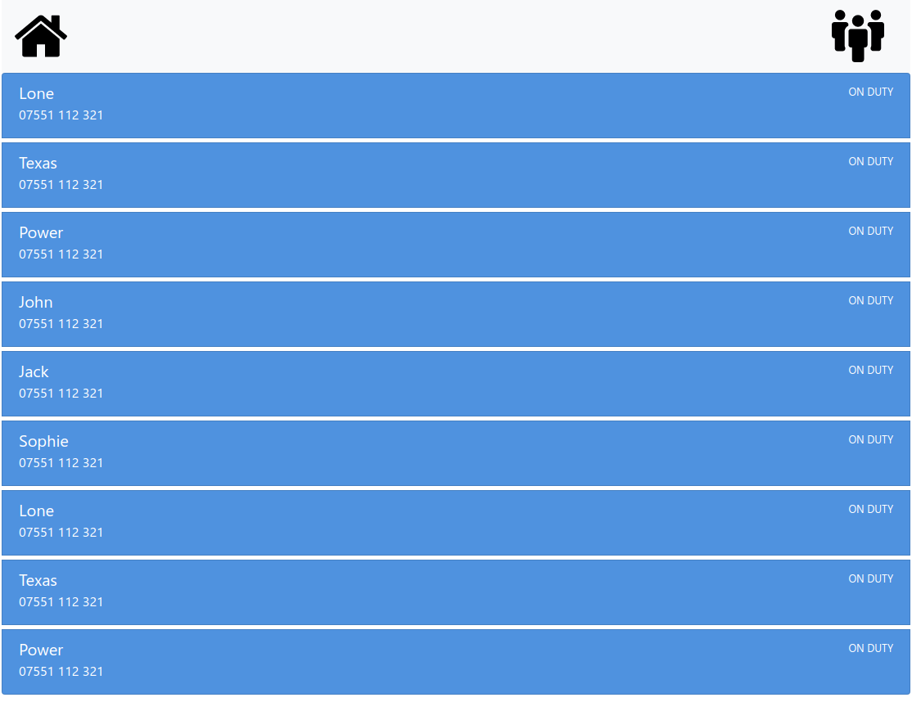
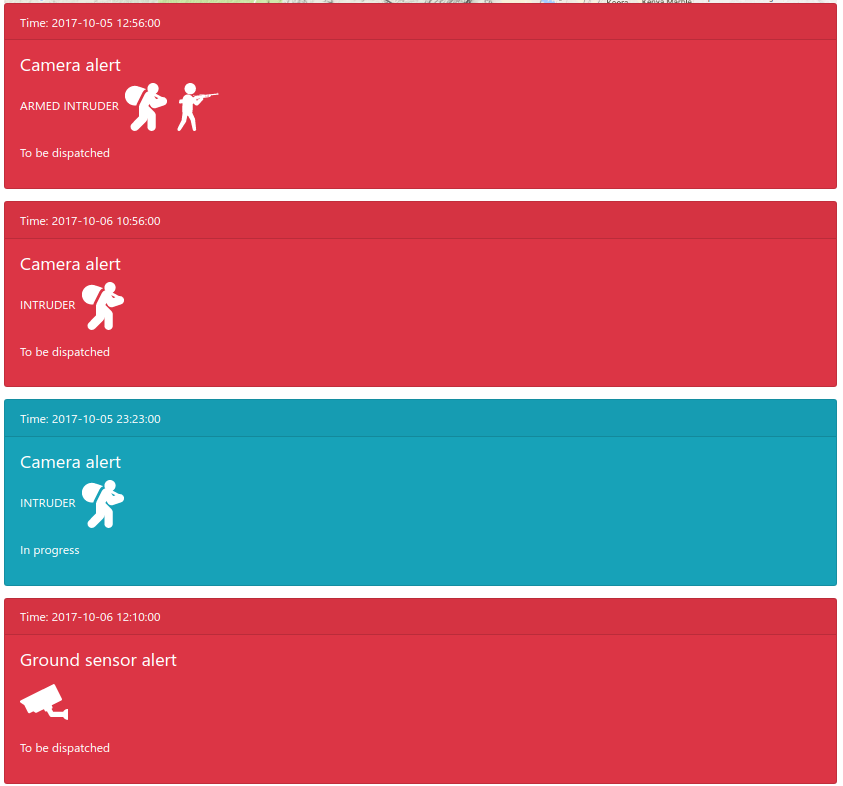
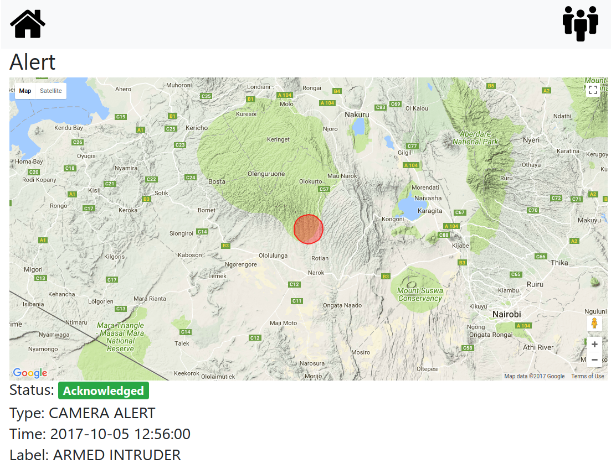

# SmartAlert

> **Automatic alert dispatching and tracking system**

---

Alerts dispatched to rangers **fighting against poachers**  require constant human monitoring and intervention.

* An operations room must be **manned 24/7**;
* Operators need to **manually** relay informations to rangers

 

### Most protected areas do not have enough resources for a human-driven system. 

---

# **SmartAlert**

---

**SmartAlert** can be entirely deployed on a Raspberry Pi *(30£)* and does not require human intervention.

 

---

**SmartAlert** provides the following **customizable** features:

* Monitoring and normalization of sensor data;
* Stripping of sensitive information;
* Location-based dispatching rules;
* Information relying *(e.g. through GSM or radio)*;
* Anti-corruption auditing;
* Data post-processing support *(e.g. machine learning)*

---

---

One of SmartAlert's main goals is **user-friendliness**.

The **UI** has been designed to be **as simple as possible** and usable on **devices of any kind**.

---

---

---

---

---

---

# Cheap

# Simple

# Fast
 
# Secure

# Flexible

# Impactful

